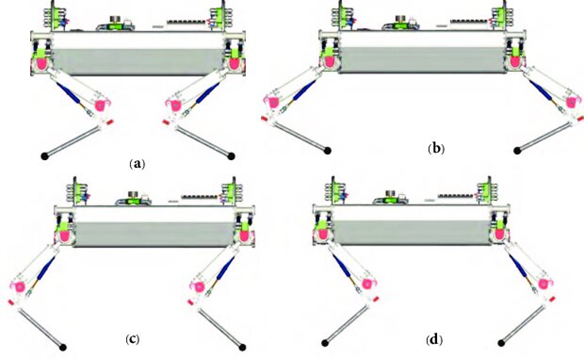
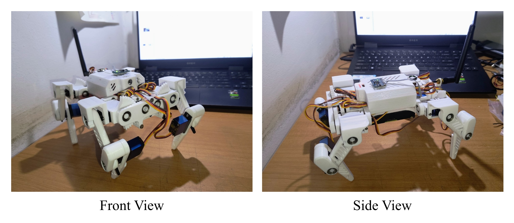

# RoboDog-Gen-2

## What is RoboDog?  

RoboDog is an Open Source, 12 DOF Quadruped robot aimed to provide an affordable platform for four legged robotics applications.  

## Why a Dog?

It's not just about Dogs! it can mimic any four legged animal based on the configuration.  

## Configuration?

A quadruped robot can have 4 types of configuration - RoboDog can take any of those forms.

*H. Khan et al., "Development of the lightweight hydraulic quadruped robot — MiniHyQ,"*

## RoboDog Gen 2

### Build Instructions?

Check back soon!

## DISCLAIMER

This hardware and software project is provided "as is", and at your own risk. Under no circumstances shall any author be liable for direct, indirect, special, incidental, or consequential damages resulting from the use, misuse, or inability to use this hardware/software, even if the authors have been advised of the possibility of such damages.
